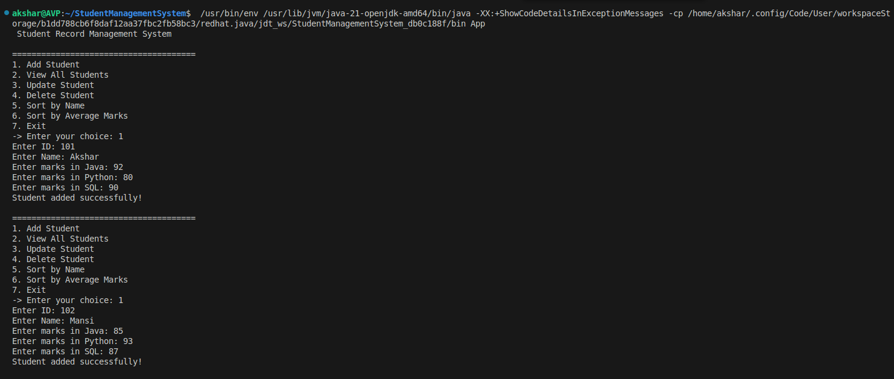
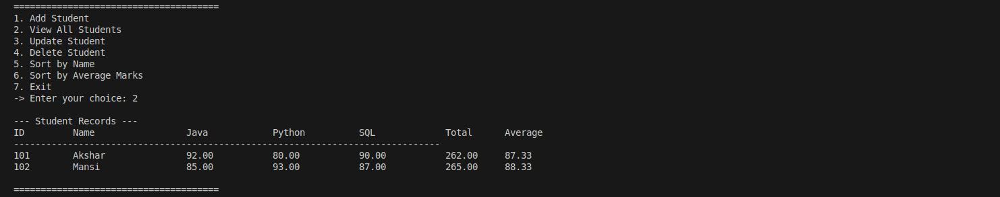

# Student Management System

## Overview
The **Student Management System** is a console-based Java application that allows managing student information, including personal details and subject-wise marks. The system supports both default marks for all students and customized marks per subject for individual students. This makes it flexible and suitable for real-world classroom or institutional scenarios.

## Features
- **Add Student:** Register new students with unique IDs and names.
- **Assign Marks:**
  - Set default marks for all subjects.
  - Assign different marks per subject for individual students.
- **Update Records:** Modify student details or subject marks.
- **View Records:** Display all students with their marks, total, and average.
- **Menu-driven Interface:** Simple console-based navigation for ease of use.

## Approach
The project uses **Java** and follows **Object-Oriented Programming** principles:

1. **Class Design:**
   - `Student` class contains student name, ID, subject marks, total, and average.
   - Methods for adding, updating, and displaying student details are encapsulated in the class or main program.

2. **Default vs Custom Marks:**
   - Default marks can be applied to all students automatically.
   - Individual students can have customized marks for each subject.

3. **Menu-driven Console Application:**
   - Users interact with a clear, step-by-step menu.
   - Input validation ensures data consistency.

4. **Extensible & Scalable:**
   - Additional features such as file/database storage, GUI interface, or more subjects can be easily added.

## Screenshots
### Adding a Student

### Viewing All Students

## Technologies Used
- **Programming Language:** Java (J2SE)
- **Development Approach:** Object-Oriented Programming
- **Execution Environment:** Console / Command Prompt

## Future Enhancements
- Integration with **MySQL** or **PostgreSQL** for persistent storage.
- Graphical User Interface (GUI) using **Java Swing** or **JavaFX**.
- Export reports (PDF/Excel) for student performance.
- Advanced search, filtering, and sorting options based on subjects or scores.
